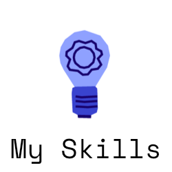

[📌 Open Helper Repo](https://github.com/xXAI-botXx/Project-Helper)

<!-- <h2>Data Science | Data Analysis | Machine Learning</h2> -->
<h2>Deep Learning | Computer Vision | Generative AI</h2>

 
 

<!--### Nice to meet you!-->

[</img>](#top)
<!--

-->
  

&nbsp;&nbsp;&nbsp;&nbsp;&nbsp;&nbsp;&nbsp;&nbsp;
&nbsp;&nbsp;&nbsp;&nbsp;&nbsp;&nbsp;&nbsp;&nbsp;
&nbsp;&nbsp;&nbsp;&nbsp;&nbsp;&nbsp;&nbsp;&nbsp;
&nbsp;&nbsp;&nbsp;&nbsp;&nbsp;&nbsp;&nbsp;&nbsp;

<!-- &nbsp;&nbsp;&nbsp;&nbsp;&nbsp;&nbsp;&nbsp;&nbsp;-->

  

Hello there, I'm Tobia or xXAI-botXx here. 
I'm an AI Engineer / ML Engineer currently making my master in the field of AI in the Offenburg University of Applied Sciences where I already made my Bachelor of Science in the field of AI. 
My world is classical Data Science (Visualizations, Data Analyzation, Classic Machine Learning Algorithms) and I feel even more comfortable in Deep Learning with a specialization towards Computer Vision. 
I see my strength in my motivation to solve difficult tasks and in documenting my work in detail.

> P.S. If you’re wondering about the name "xXAI-botXx," try reading it backward—but 🤫!

So, enjoy exploring my profile, and feel free to connect! 😄

 

___
<!--### My Skills-->

[</img>](#top)

   

### In Short
- **Data Processing**
- **Data Visualization**
- **Data Analyzation**
- **Classical Machine Learning**
  - SVM, Naive Bayes, ...
  - Scikit Learn
- **Deep Learning** (Neural Networks)
  - Computer Vision
  - Reinforcement Learning
  - Natural Language Processing
  - State of the Art Techniques
  - PyTorch
  - TensorFlow

  

### Example projects

 

   
 

<!--  -->

### My Exam Work for my Bachelor of Science

 

<a href="https://1drv.ms/b/s!AqSTBkFULemxmJgnJLD-nk2EkOn5dA?e=8EEuwZ">

    

</a>
Grade: 1,7 
<a href="https://1drv.ms/b/s!AqSTBkFULemxmJgnJLD-nk2EkOn5dA?e=8EEuwZ">Click me and read me 🚀</a>

 
 

<!--
### Certifications

---
<h3>Certification for the first part of the Bachelor of Science in Artifical Intelligence</h3>

---
Here I learned the basics of a data scientist. Started with basic/overview of artificial intelligence, programming basics, informatics basics, mathematic and statistic basics, visual analysis basics and of course machine learning basics (+ softskills for business).
   
</img>
</img>

  

---
<h3>Machine Learning Course on Udemy</h3>

---
This online course on udemy has accompanied me through my studies until now. I learned a lot about machine learning and partly deepened my knowledge. Furthermore I could take a relativly deep look in advanced topic like Deep Learning, Reinforcement Learning and Computer Vision.
   
</img>

  

---
<h3>Reinforcement Learning Course on Udemy</h3>

---
An extensive course with a lecturer who knows his subject well and has experience in passing on his knowledge. The Course starts with the basic of reinforcement learning: basic liberaries, basics of artificial neural networks and CNN for working with images as input only. 
We continued with the theory of reinforcement learning. From here it got more and more specific. So Q-Learning was looked at and then Deep-Q-Learning. 
During this time I was able to get to know the openai gym library and at the end I learned to create and register my own environment on gym. 
 
Content:  
</img>
   
</img>

 
 
-->

### Presentations

In addition I bring other skills with me. Among other things, presentation skills. My presentations are created for visual understanding with many animations and only make 100% sense when spoken. So far I have received extremely good feedback for my way of presenting and I always enjoy it very much.  
Here I will share some of my prasentations with you. Feel free to watch a few of them :)

---
<h3><a href=https://prezi.com/view/vh7gksgU4j08iUtKECqT/>GPT-3</a></h3>

---
A presentation about the GPT-3 Paper.
   
</img>
</img>
</img>
</img>
</img>

  

---
<h3><a href=https://prezi.com/view/KOqFTcdj01JzbzEXPm0j>Mean Shift</a></h3>

---
My part is the Mean Shift.
   
</img>
</img>
</img>
  

---
<h3><a href=https://prezi.com/view/50Ptxgfn9dE4Pil3je0p/>Job Post Similarity</a></h3>

---
My part is Einführung, Word2Vec, Location + Type, Anwendung.
   
</img>
</img>
</img>
</img>
  

  
And there are more 🥳

 
 

<!-- adding soft skills? -->

 

___
<!--### My Work-->
<!--

[</img>](#top)

  

    

I know, sometimes it can be difficult to get an overview of an account and its projects from the outside. 
To simplify that, I listed my repositories by category and with some words to classify it easier.

> Hint: Some projects are too secret to show on github or were made without git.

**Machine Learning Projects**

- [Generative Deep Learning](https://github.com/xXAI-botXx/Generative-Deep-Learning) 
  Summariezed knoledge about generative ai, which is a crucial part of machine learning / deep learning and responsible for many awesome AI abilities. This project includes theory and practise.
- [Mask-RCNN for PyTorch Instance Segmentation](https://github.com/xXAI-botXx/torch-mask-rcnn-instance-segmentation) 
  I use the MASkRCNN from PyTorch to make a instance segmentation. Training Loop, Inference, Data Preparation, ...
- [3xM](https://github.com/xXAI-botXx/3xM) 
  The triple M dataset is a syntethic computer vision dataset for instance-segmentation for bin-picking using Unreal Engine 5. Specially created to control the amount of 3D-Models and Materials during the datageneration process. I created multiple datasets each with 20.000 automatically labelled images for my bachelor exam.
- [Comfortable Yolact](https://github.com/xXAI-botXx/comfortable-yolact) 
  This is a YOLACT Wrapper, with easy installation and easy training and easy inference. There is also an installation notebook, to check your installation and also show you the architecture as well as  the exact input and output of the YOLACT Model. This repo fixes the config file based approach to make YOLACT usable in python code like in notebooks. There is a notebook for training and one for inference.
- [Genetic Algorithm](https://github.com/xXAI-botXx/Genetic-Algorithm) 
  Hyperparamater-Optimization from Deep-Learning and Machine Learning Models with Gentic Algorithm. A [PyPi project](https://pypi.org/project/Simple-Genetic-Algorithm/) and also can used for any other usage. The documentation should be self-explaining with examples.
- [Calm Down Bot](https://github.com/xXAI-botXx/Calm-down-bot) 
  A GPT-2 based Chat-bot for mental distress. Trained on ChatGPT-3 generated Chatlogs.
- [ANN-106](https://github.com/xXAI-botXx/ANN-106) 
  An educational project, where i try to program my own deep learning library.
- [Wer hat gebohrt?](https://github.com/xXAI-botXx/Wer-hat-gebohrt) 
  In this project, an application was programmed that collects drilling data using a GUI and then tries to assign a driller to one of two people using ML algorithms. The 2 people had to create training data beforehand. Voltage, audio and current data are available. 
  This project is quite extensive and so I wrote my own API documentation for it. [Click here to see it](https://xxai-botxx.github.io/Wer-hat-gebohrt/) (I love it😍). 
  This project contains many things. From data-collection to model-training to prediction and parallel programming, GUI-programming. It's a good project to see how nice a GUI can look with TKinter, too.
- [Job Posts Similarity](https://github.com/xXAI-botXx/Job-Posts-Similarity) 
  The task here is to find similar job posts using NLP. I used SpaCy for this task and this project was made in coorperation with Syon Kadkade. 
  Important part of this project was to analyse the problem and find a solution. Above all, I did very scientific work here.
- [Weather Collection](https://github.com/xXAI-botXx/Weather-Collection) 
  This is a helper project for the Weather Analysis (before i saw that it doesn't work at all). It's about collecting data from a website over a period of time. Like every hour. For that I used Silenium Lib. And it works...partly. Unfortunaly the data collection regularly take a break for a few days...maybe thats a problem from replit where i run the code. 
  Today I would use other liberaies instead such as request-lib with BeatifulSoup-lib for collecting the data.
- [YouTube Advertising Blocking Bot](https://github.com/xXAI-botXx/YouTube-Bot) 
  This is not supposed to be a real application and was not sufficiently developed for that. So don't use it for blocking advertising. It is a computer vision project to recognize objects in images. In this case a skip advertising-button recognition. It is developed for the german language and for my 2 monitors at home.
- And more are planned 🥳🚀
 

**Other Python Projects**
- [QR-Code Creator](https://github.com/xXAI-botXx/QR-Code-Creator) 
  This repo contains an generator for QR-COdes developed for Replit.
- [Discord Bot](https://github.com/xXAI-botXx/Discord-Bot) 
  It's about an allrounder Bot for discord. The bot offers a wide range of skills and is the perfect chat-assistent. 
  I invested a lot of time and the code is nowadays partwise a bit messy. But I love the bot. It can draw function, calculate calculations, flip a coin, play chess, play YouTube Videos as MP3 and much more! My favourite game is 4-wins which the bot also can do.
- [Python Lair](https://github.com/xXAI-botXx/Python_Lair) 
  Python Lair is a block based python IDE programmed in python. It is a project for fun. I used PyQt for the GUI.
- [Chess](https://github.com/xXAI-botXx/Chess) 
  It's the logic of chess. It was so programmed, that I can implement it on diffrent plattforms like in my Discord Bot.
- [Textbased labyrinth RPG](https://github.com/xXAI-botXx/Textbasiertes-RPG) 
  Inspired from the greek mythology and the maze runner saga I programmed a textbased labyrinth game. Goal is to escape and find the next level. In future I want to implement enemies, combat-system and other things that I like.
- [Python Execution](https://github.com/xXAI-botXx/Python-Execution) 
  This repo contains to ipynb-files which shows very basic functionality from python. It's very interesting because you can use the python execution for analysing code. How? Watch the repo. It's worth it :) 
  On one side you can show and handle with AST's, these are a part of the python execution. The python code going to represent as tree and thats can be useful. The math-console brings that on the point. 
  Moreover you can see the C-byte-instructions of the code to improve the performance of your code.
- [Website Publisher](https://github.com/xXAI-botXx/Rainbow_Six_Website) 
  In this project I wrote a server-application for an old website from me about a game. I used flask to run the website locally.
- [Chat Analysis](https://github.com/xXAI-botXx/Chat-Analysis)
  A chat analyzsis between me and my girlfriend. I created a super cool website.

 

**Java Repositories**
- [Pi-Collision](https://github.com/xXAI-botXx/Pi_Collisions) 
  It's about an application for showing the pi-collision effect. It's a small application with a GUI and some physics in it. The Pi-Collision-effect is that if 2 objects collide and there is a wall, the amount of collisions going to be the number of pi. It's very interesting. To go higher with the amount of collisions I implemted a performance mode, where nothing is drawing and the collisions going faster.  
- [Falling Champion](https://github.com/xXAI-botXx/Falling-Champion) 
  Falling Champion is the title of my own created game. I used Java to make a really fun game. Special for my games are the credits. I think it is a nice game and it was particularly important to me that it is a well-rounded overall package.
- [2D Bomberman](https://github.com/xXAI-botXx/2D-Bomberman) 
  Another game heavily inspired of the original Bomberman. And there is an easter egg in the credits!
- [Hearts](https://github.com/xXAI-botXx/Hearts) 
  In this project I implemented the cardgame hearts in java with server programming. And there is a GUI.
- [Interactive Text Adventure Reader](https://github.com/xXAI-botXx/Text-Adventure) 
  It should be an application for interactive stories and they should be written by the users it self too. Unfortunately i wasn't creative enough to write a nice story 😂
- [Magic-Sovereign](https://github.com/xXAI-botXx/Magic-Sovereign) 
  Probably my first own Java Game with pretty much no features 😂 I love this project neverless! I wanted to code a Pokemon clone.
- [Super-Zeldario](https://github.com/xXAI-botXx/Super-Zeldario) 
  One of my firsts coding projects with friends. We wanted to make a Zelda clone but did not come far.

 

**Other Repositories**
- [Bachelor-Exam](https://github.com/xXAI-botXx/Bachelor-Exam) 
  Git project of my bachelor exam, including writing, planning, research and more.
- [Master-Exam](https://github.com/xXAI-botXx/Master-Exam) 
  Git project of my master exam, including writing, planning, research and more.
- [The Cave Code](https://github.com/xXAI-botXx/cave_code) 
  This Project is a ambitious project to find the slution for every problem. It is an unrealistic project and right now it is just an idea. I still have to figure out how I can use AI to achieve the goal. Right now there is no code, just my ideas and my plan.
- [Chinesisch](https://github.com/xXAI-botXx/Chinesisch) 
  This project tries to collect knowledge about china. The language, the geography and mythology. No Coding in this project!

 

**Helper Repositories**
- [Project Helper](https://github.com/xXAI-botXx/Project-Helper) 
  This repo should include important files which help me out. As example a guide for git. 
  It should grows over the time and should contain basic code as cook-recipes and guides to important topics. 
  Maybe you find something helpful, too. It references to other "helper" repositories, which partwise are not listed here.
- [Pythonic X-Ray](https://github.com/xXAI-botXx/Pythonic-X-ray) 
  Easily get interesting code insights to your work.
- [Mouse-Keyboard-Activity](https://github.com/xXAI-botXx/Mouse-Keyboard-Activity) 
  Presses a given button every X minutes on a given position on your display and can move the mouse random.
- [Computer Vision](https://github.com/xXAI-botXx/computer-vision) 
  Contains some important and basic Computer Vision tasks with OpenCV. It's more like an helper project.
- [Deep-Learning-for-Medical-Images](https://github.com/xXAI-botXx/Deep-Learning-for-Medical-Images) 
   This repo covers some basics for deep learning in the field of medical images. There are also some easy basics about numpy and pytorch.

 
That are my repositories (since the date 31.05.2025).

  
-->

___
<!--### Showroom -->

[</img>](#top)

   

Here i will provide some pictures and videos. I think it's interesting to see something 😊

<!--

    

-->

  

---
<h3 align='center'>Python Lair</h3>

---

https://user-images.githubusercontent.com/50902823/172580733-9cad99d5-dfa9-4c0a-8fda-9cf466af1581.mp4

 

https://user-images.githubusercontent.com/50902823/172580754-6be96943-9a3c-424b-9a8a-7aee3b37a33d.mp4

   
<!--
---
<h3 align='center'>Visualizations</h3>

---
...

    

---
<h3 align='center'>Discord Bot</h3>

---

</img>
</img>
</img>
</img>
</img>
</img>

   
-->

---
<h3 align='center'>2D Bomberman</h3>

---

https://user-images.githubusercontent.com/50902823/172580887-b5e822a1-8e07-45e6-a8ba-9208df50c9f4.mp4

 

https://user-images.githubusercontent.com/50902823/172581485-8c157091-c30d-4369-9b70-f4ef87e996d6.mp4

   

---
<h3 align='center'>Falling Champion</h3>

---

https://user-images.githubusercontent.com/50902823/172581641-422c87a7-d38b-4701-aac8-5488fefa7acf.mp4

 

https://user-images.githubusercontent.com/50902823/172581702-788d3199-0dbd-441e-b2d2-f6d2797b3858.mp4

 

https://user-images.githubusercontent.com/50902823/172581750-1b917fe7-24ce-4b1f-b265-744d0c003c81.mp4

   

---
<h3 align='center'>Hearts</h3>

---

https://user-images.githubusercontent.com/50902823/172581886-c1ae8a0c-1641-4881-a45a-59b105904a84.mp4

 

https://user-images.githubusercontent.com/50902823/172581895-a2640416-f8ec-4620-83f7-8ab00aa18292.mp4

   

---
<h3 align='center'>YouTube Bot</h3>

---

https://user-images.githubusercontent.com/50902823/172582689-25d630c9-af9c-41ab-862b-cbdeb6c0a616.mp4

 

https://user-images.githubusercontent.com/50902823/172582708-848f2779-d2dd-431a-8697-2e484d14a81c.mp4

   

---
<h3 align='center'>Pi Collision</h3>

---

https://user-images.githubusercontent.com/50902823/172583018-d778dd4d-e381-471f-ad06-e4682904d5ad.mp4

   

---
<h3 align='center'>Text Adventure</h3>

---

https://user-images.githubusercontent.com/50902823/172582920-1bbe8805-135a-4bd5-ad44-8d52e977d2f2.mp4

  

---
<h3 align='center'>PS5 Bot</h3>

---

https://user-images.githubusercontent.com/50902823/172582564-b6596300-cd7e-4287-9da8-b273be31389b.mp4

---
<h3 align='center'>Magic-Sovereign</h3>

---

https://github.com/user-attachments/assets/93646c3a-5abc-4559-9a49-9a62e7c4d9db

---
<h3 align='center'>Super-Zeldario</h3>

---

https://github.com/user-attachments/assets/ac2ee6b7-60d4-4c6d-bf00-294eac79c29c

   

---
<h3 align='center'>Reinforcement Learning - OpenAI gym - CartPole</h3>

---

https://user-images.githubusercontent.com/50902823/191060465-2dd076cc-2577-47c5-8057-a14417f24dae.mp4

  

___
<!--### Stats-->

[</img>](#top)

   

 &nbsp;&nbsp;&nbsp;&nbsp;&nbsp;&nbsp;&nbsp;&nbsp; 
<!--&nbsp;&nbsp;&nbsp;&nbsp;&nbsp;&nbsp;&nbsp;&nbsp;

-->

  
___
<!--### Connect with me-->

[</img>](#top)

  

I hope you liked my profile and maybe you want to connect with me :) 
Every Icon stands for a different platform and a click on it leads you to their website. In addition to that, every icon has a tooltip with my username in it -> so hover the icon and stay there for a second to see my data.

<!--  
By the way, my insider tip for new friendships among social media is Slowly. -->

   

&nbsp;&nbsp;&nbsp;&nbsp;&nbsp;&nbsp;&nbsp;&nbsp;
&nbsp;&nbsp;&nbsp;&nbsp;&nbsp;&nbsp;&nbsp;&nbsp;
&nbsp;&nbsp;&nbsp;&nbsp;&nbsp;&nbsp;&nbsp;&nbsp;
&nbsp;&nbsp;&nbsp;&nbsp;&nbsp;&nbsp;&nbsp;&nbsp;
 
&nbsp;&nbsp;&nbsp;&nbsp;&nbsp;&nbsp;&nbsp;&nbsp;

<!--

&nbsp;&nbsp;&nbsp;&nbsp;&nbsp;&nbsp;&nbsp;&nbsp;-->

  

___

Special thanks to [Elisa Wilkes](https://www.linkedin.com/in/elisa-wilkes-4691a9198) for the creation of the illustrations
___

<!--
  

    

-->