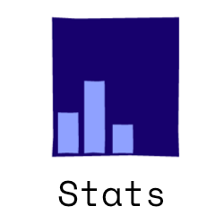

<div align="center">

[](https://youtu.be/6TDvzrRI7SE)
    
</div>

<br>
<br>

<a name="top"></a>


<!--### Nice to meet you!-->
<a name="Introduction"></a>
[</img>](#top)
<!--


-->
<br><br>

<div align="center">

[](#My-Skills)&nbsp;&nbsp;&nbsp;&nbsp;&nbsp;&nbsp;&nbsp;&nbsp;
[](#My-Work)&nbsp;&nbsp;&nbsp;&nbsp;&nbsp;&nbsp;&nbsp;&nbsp;
[](#Visual-Impression)&nbsp;&nbsp;&nbsp;&nbsp;&nbsp;&nbsp;&nbsp;&nbsp;
[](#Showroom)&nbsp;&nbsp;&nbsp;&nbsp;&nbsp;&nbsp;&nbsp;&nbsp;
[](#Stats)&nbsp;&nbsp;&nbsp;&nbsp;&nbsp;&nbsp;&nbsp;&nbsp;
[](#Connect-with-me)&nbsp;&nbsp;&nbsp;&nbsp;&nbsp;&nbsp;&nbsp;&nbsp;

</div>

<br><br>

I'm Tobia or xXAI-botXx here. Aspiring data scientist and currently studying [artificial intelligence](https://www.hs-offenburg.de/studium/studiengaenge/bachelor/angewandte-kuenstliche-intelligenz/studieninteressierte) in germany.<br>
I started with Java and wanted to make games. After some 2D Games such like my 2D (low Budget) Bomberman or my Falling Champion I had enough of games and my dream was fulfilled in a certain way...<br>
This gap was and still is filled with the world of data and artificial intelligence.<br>
I love to make projects and online courses in this field and learn more and more about it. And there is currently no end to the learning process in sight. There are so many interesting areas and areas of application, it's so marvelous.<br>
At this point I can't choose a specific area which I will focus on. I would like to gain more experience and knowledge before i make a decision here.
<br>
<br>
Away from the zeros and ones I like to be in nature and have found a passion in photography (although i still have a lot to learn here, but that doesn't matter for the fun).<br>
I also like reading and listening to books. It ranges from fantasy to specialist books. If I had to choose a genre it would probably be fantasy (or sometimes science fiction). But definitely not crime or thriller.
<br>
<br>

> If you asked yourself why xXAI-botXx than read it backwards but🤫
<br>
So...Enjoy my profile! 😄

<div align=center>

[](# "Ssss 3.14159265359")

</div>

<br>

___
<!--### My Skills-->

<a name="My-Skills"></a>
[</img>](#top)

<br><br>
[](https://github.com/xXAI-botXx/Wer-hat-gebohrt)
[](https://github.com/xXAI-botXx/Job-Posts-Similarity)
<br><br><br>
<br>

<!--
</img>
-->

## Overview
(just about)

- 
  - Numpy
  - Pandas
  - Sklearn
  - Matplotlib/Seaborn
  - Tensorflow/Keras
  - PyTorch 
- Data Science Knowledge
  - Pipeline & basics
  - Data Preparation & Extraction
  - Data Engineering
  - Machine Learning
  - Deep Learning
  - Mathematical and statistical fundamentals for DS
- KNIME
- Power BI 
- SQL
- Git
- 
- learn with every project more :)

<br>
<br>

## Presentations

In addition to that I bring other skills with me. Among other things, presentation skills. My presentations are created for visual understanding with many animations and only make 100% sense when spoken. So far I have received extremely good feedback for my way of presenting and I always enjoy it very much. <br>
Here I will share some of my prasentations with you. Feel free to watch a few of them :)

<div align=center>

---
<h3><a href=https://prezi.com/view/vh7gksgU4j08iUtKECqT/>GPT-3</a></h3>

---
My part is the Mean Shift.
<br><br><br>

<br><br>

---
<h3><a href=https://prezi.com/view/KOqFTcdj01JzbzEXPm0j>Mean Shift</a></h3>

---
My part is the Mean Shift.
<br><br><br>
</img>
</img>
</img>
<br><br>

---
<h3><a href=https://prezi.com/view/50Ptxgfn9dE4Pil3je0p/>Job Post Similarity</a></h3>

---
My part is Einführung, Word2Vec, Location + Type, Anwendung.
<br><br><br>
</img>
</img>
</img>
</img>
<br><br>

---
<h3><a href=https://prezi.com/view/7mU4Cw0tUzXC6Ljgf36I>Projekt 1: Automation</a></h3>

---
My part is the full presentation.
<br><br><br>
</img>
</img>
</img>
<br><br>

---
<h3><a href=https://prezi.com/view/KPaFuUE4Su0TQ6gRGPue/>JVM</a></h3>

---
My part is the full presentation.
<br><br><br>
</img>
</img>
</img>
</img>
<br><br>

---
<h3><a href=https://prezi.com/view/GumafVI493iUUlJIZCTT/>Web Agentur</a></h3>

---
My part is 'Unser Unternehmen', 'Projekt', 'Projektstrukturplan', 'Ganttbalkendiagramm', 'Netzwerk an Kommunikationspartnern' and 'Herausforderungen'.
<br><br><br>
</img>
</img>
</img>


<br><br>
And there are more :)


</div>

<br>
<br>

## Certifications

<div align=center>

---
<h3>Certification for the first part of the Bachelor of Science in Artifical Intelligence</h3>

---
Here I learned the basics of a data scientist. Started with basic/overview of artificial intelligence, programming basics, informatics basics, mathematic and statistic basics, visual analysis basics and of course machine learning basics (+ softskills for business).
<br><br><br>
</img>
</img>

<br><br>

---
<h3>Machine Learning Course on Udemy</h3>

---
This online course on udemy has accompanied me through my studies until now. I learned a lot about machine learning and partly deepened my knowledge. Furthermore I could take a relativly deep look in advanced topic like Deep Learning, Reinforcement Learning and Computer Vision.
<br><br><br>
</img>

<br><br>

---
<h3>Reinforcement Learning Course on Udemy</h3>

---
An extensive course with a lecturer who knows his subject well and has experience in passing on his knowledge. The Course starts with the basic of reinforcement learning: basic liberaries, basics of artificial neural networks and CNN for working with images as input only.<br>
We continued with the theory of reinforcement learning. From here it got more and more specific. So Q-Learning was looked at and then Deep-Q-Learning.<br>
During this time I was able to get to know the openai gym library and at the end I learned to create and register my own environment on gym.<br>
<br>
Content:<br><br>
</img>
<br><br><br>
</img>

<br><br>
*More are coming soon

</div>

<!-- adding soft skills? -->

<br>

___
<!--### My Work-->
<a name="My-Work"></a>
[</img>](#top)

<br><br>

<div align="center">

[](https://youtu.be/5GdyDu5R9Sg)
    
</div>

I know, sometimes it can be difficult to get an overview of an account and thers projects from the outside. 
To simplify that, i listed my repositories by category and with some words to classify it easier:<br>

**Data Science Projects**

- [Wer hat gebohrt?](https://github.com/xXAI-botXx/Wer-hat-gebohrt)<br>
  In this project, an application was programmed that collects drilling data using a GUI and then tries to assign a driller to one of two people using ML algorithms. The 2 people had to create training data beforehand. Voltage, audio and current data are available.<br>
  This project is quite extensive and so I wrote my own API documentation for it. [Click here to see it](https://xxai-botxx.github.io/Wer-hat-gebohrt/) (I love it😍).<br>
  This project contains many things. From data-collection to model-training to prediction and parallel programming, GUI-programming. It's a good project to see how nice a GUI can look with TKinter, too.
- [Job Posts Similarity](https://github.com/xXAI-botXx/Job-Posts-Similarity)<br>
  The task here is to find similar job posts using NLP. I used SpaCy for this task and this project was made in coorperation with Syon Kadkade.<br>
  Important part of this project was to analyse the problem and find a solution. Above all, I did very scientific work here.
- [Weather Analysis](https://github.com/xXAI-botXx/Weather-Analysis)<br>
  This project has the goal to visualize, explore and forcasting weather data. It's not finished yet and I started to load and wrangling weather data buyed from OpenWeatherMap for freiburg.<br>
  Visualization is done by using plotly. The forecasting should done by using PyTorch.
- [Weather Collection](https://github.com/xXAI-botXx/Weather-Collection)<br>
  This is a helper project for the Weather Analysis (before i saw that it doesn't work at all). It's about collecting data from a website over a period of time. Like every hour. For that I used Silenium Lib. And it works...partly. Unfortunaly the data collection regularly take a break for a few days...maybe thats a problem from replit where i run the code.<br>
  Today I would use other liberaies instead such as request-lib with BeatifulSoup-lib for collecting the data.
- [YouTube Advertising Blocking Bot](https://github.com/xXAI-botXx/YouTube-Bot)<br>
  This is not supposed to be a real application and was not sufficiently developed for that. So don't use it for blocking advertising. It is a computer vision project to recognize objects in images. In this case a skip advertising-button recognition. It is developed for the german language and for my 2 monitors at home.
- And more are planned :)
<br>

**Other Python Projects**
- [QR-Code Creator](https://github.com/xXAI-botXx/QR-Code-Creator)<br>
  This repo contains an generator for QR-COdes developed for Replit.
- [Discord Bot](https://github.com/xXAI-botXx/Discord-Bot) -> not visible yet, but soon :)<br>
  It's about a alrounder Bot for discord. The bot offers a wide range of skills and is the perfect chat-assistent.<br>
  I invested a lot of time and the code is nowadays partwise a bit messy. But I love the bot. It can draw function, calculate calculations, flip a coin, play chess, play YouTube Videos as MP3 and much more!
- [Python Lair](https://github.com/xXAI-botXx/Python_Lair)<br>
  Python Lair is a block based python IDE programmed in python. It is a project for fun. I used PyQt for the GUI.
- [Chess](https://github.com/xXAI-botXx/Chess)<br>
  It's the logic of chess. It was so programmed, that I can implement it on diffrent plattforms like in my Discord Bot.
- [Textbased labyrinth RPG](https://github.com/xXAI-botXx/Textbasiertes-RPG)<br>
  Inspired from the greek mythology and the maze runner saga I programmed a textbased labyrinth game. Goal is to escape and find the next level. In future I want to implement enemies, combat-system and other things that I like.
- [Python Execution](https://github.com/xXAI-botXx/Python-Execution)<br>
  This repo contains to ipynb-files which shows very basic functionality from python. It's very interesting because you can use the python execution for analysing code. How? Watch the repo. It's worth it :)<br>
  On one side you can show and handle with AST's, these are a part of the python execution. The python code going to represent as tree and thats can be useful. The math-console brings that on the point.<br>
  Moreover you can see the C-byte-instructions of the code to improve the performance of your code.
- [Website Publisher](https://github.com/xXAI-botXx/Rainbow_Six_Website)<br>
  In this project I wrote a server-application for an old website of me over a game. I used flask to run the website locally.


<br>

**Java Repositories**
- [Pi-Collision](https://github.com/xXAI-botXx/Pi_Collisions)<br>
  It's about an application for showing the pi-collision effect. It's a small application with a GUI and some physics in it. The Pi-Collision-effect is that if 2 objects collide and there is a wall, the amount of collisions going to be the number of pi. It's very interesting. To go higher with the amount of collisions I implemted a performance mode, where nothing is drawing and the collisions going faster.  
  
- [Falling Champion](https://github.com/xXAI-botXx/Falling-Champion)<br>
  Falling Champion is the title of my own created game. I used Java to make a really fun game. Special for my games are the credits. I think it is a nice game and it was particularly important to me that it is a well-rounded overall package.
  
- [2D Bomberman](https://github.com/xXAI-botXx/2D-Bomberman)<br>
  Another game heavily inspired of the original Bomberman. And there is an easter egg in the credits!
  
- [Hearts](https://github.com/xXAI-botXx/Hearts)<br>
  In this project I implemented the cardgame hearts in java with server programming. And there is a GUI.

- [Interactive Text Adventure Reader](https://github.com/xXAI-botXx/Text-Adventure)<br>
  It should be an application for interactive stories and they should be written by the users it self too. Unfortunately i wasn't creative enough to write a nice story 😂

<br>

**Other Repositories**
- [Project Helper](https://github.com/xXAI-botXx/Project-Helper)<br>
  This repo should include important files which help me out. As example a guide for git.<br>
  It should grows over the time and should contain basic code as cook-recipes and guides to important topics.<br>
  Maybe you find something helpful, too.

<!-- Maybe add some pictures and videos directly here ? -->
<!-- Add README's to each repo and add pictures and videos for them -->

<br>
That are my repositories (since the date 06.06.2022).

<br><br>

___
<!--### Visual Impression-->
<a name="Visual-Impression"></a>
[</img>](#top)

<br><br><br>

</img>
</img>
</img>

<br><br>

___
<!--### Showroom -->
<a name="Showroom"></a>
[</img>](#top)

<br><br><br>

Here i will provide some pictures and videos. I think it's interesting to see something :)

<div align="center">

[](https://youtu.be/CCux_wlTmgo)
    
</div>

<br><br>

---
<h3 align='center'>Python Lair</h3>

---


https://user-images.githubusercontent.com/50902823/172580733-9cad99d5-dfa9-4c0a-8fda-9cf466af1581.mp4

<br>

https://user-images.githubusercontent.com/50902823/172580754-6be96943-9a3c-424b-9a8a-7aee3b37a33d.mp4


<br> <br>
<!--
---
<h3 align='center'>Visualizations</h3>

---
...

<br> <br> 

---
<h3 align='center'>Discord Bot</h3>

---

<div style="float:left">

</img>
</img>
</img>
</img>
</img>
</img>

</div>

<br> <br>
-->

---
<h3 align='center'>2D Bomberman</h3>

---


https://user-images.githubusercontent.com/50902823/172580887-b5e822a1-8e07-45e6-a8ba-9208df50c9f4.mp4

<br>

https://user-images.githubusercontent.com/50902823/172581485-8c157091-c30d-4369-9b70-f4ef87e996d6.mp4

<br> <br>

---
<h3 align='center'>Falling Champion</h3>

---


https://user-images.githubusercontent.com/50902823/172581641-422c87a7-d38b-4701-aac8-5488fefa7acf.mp4

<br>

https://user-images.githubusercontent.com/50902823/172581702-788d3199-0dbd-441e-b2d2-f6d2797b3858.mp4

<br>

https://user-images.githubusercontent.com/50902823/172581750-1b917fe7-24ce-4b1f-b265-744d0c003c81.mp4

<br> <br>

---
<h3 align='center'>Hearts</h3>

---

https://user-images.githubusercontent.com/50902823/172581886-c1ae8a0c-1641-4881-a45a-59b105904a84.mp4

<br>

https://user-images.githubusercontent.com/50902823/172581895-a2640416-f8ec-4620-83f7-8ab00aa18292.mp4

<br> <br>

---
<h3 align='center'>YouTube Bot</h3>

---


https://user-images.githubusercontent.com/50902823/172582689-25d630c9-af9c-41ab-862b-cbdeb6c0a616.mp4

<br>

https://user-images.githubusercontent.com/50902823/172582708-848f2779-d2dd-431a-8697-2e484d14a81c.mp4


<br> <br>

---
<h3 align='center'>Pi Collision</h3>

---

https://user-images.githubusercontent.com/50902823/172583018-d778dd4d-e381-471f-ad06-e4682904d5ad.mp4

<br> <br>

---
<h3 align='center'>Text Adventure</h3>

---

https://user-images.githubusercontent.com/50902823/172582920-1bbe8805-135a-4bd5-ad44-8d52e977d2f2.mp4

<br><br>

---
<h3 align='center'>PS5 Bot</h3>

---

https://user-images.githubusercontent.com/50902823/172582564-b6596300-cd7e-4287-9da8-b273be31389b.mp4


<br> <br>

---
<h3 align='center'>Reinforcement Learning - OpenAI gym - CartPole</h3>

---

https://user-images.githubusercontent.com/50902823/191060465-2dd076cc-2577-47c5-8057-a14417f24dae.mp4


<br><br>

___
<!--### Stats-->
<a name="Stats"></a>
[</img>](#top)

<br><br><br>

[](https://github.com/anuraghazra/github-readme-stats) &nbsp;&nbsp;&nbsp;&nbsp;&nbsp;&nbsp;&nbsp;&nbsp; 
&nbsp;&nbsp;&nbsp;&nbsp;&nbsp;&nbsp;&nbsp;&nbsp;

<br><br>
<!--
</img>

<br><br>-->

<!--START_SECTION:waka-->
**🐱 My GitHub Data** 

> 🏆 314 Contributions in the Year 2022
 > 
> 📦 1.8 MB Used in GitHub's Storage 
 > 
> 🚫 Not Opted to Hire
 > 
> 📜 22 Public Repositories 
 > 
> 🔑 7 Private Repositories  
 > 
**I'm an Early 🐤** 

```text
🌞 Morning    129 commits    ███████░░░░░░░░░░░░░░░░░░   30.57% 
🌆 Daytime    162 commits    █████████░░░░░░░░░░░░░░░░   38.39% 
🌃 Evening    100 commits    ██████░░░░░░░░░░░░░░░░░░░   23.7% 
🌙 Night      31 commits     █░░░░░░░░░░░░░░░░░░░░░░░░   7.35%

```
📅 **I'm Most Productive on Wednesday** 

```text
Monday       72 commits     ████░░░░░░░░░░░░░░░░░░░░░   17.06% 
Tuesday      43 commits     ██░░░░░░░░░░░░░░░░░░░░░░░   10.19% 
Wednesday    100 commits    ██████░░░░░░░░░░░░░░░░░░░   23.7% 
Thursday     71 commits     ████░░░░░░░░░░░░░░░░░░░░░   16.82% 
Friday       63 commits     ███░░░░░░░░░░░░░░░░░░░░░░   14.93% 
Saturday     22 commits     █░░░░░░░░░░░░░░░░░░░░░░░░   5.21% 
Sunday       51 commits     ███░░░░░░░░░░░░░░░░░░░░░░   12.09%

```


**I Mostly Code in Java** 

```text
Java                     14 repos            ██████████░░░░░░░░░░░░░░░   41.18% 
Python                   11 repos            ████████░░░░░░░░░░░░░░░░░   32.35% 
Jupyter Notebook         6 repos             ████░░░░░░░░░░░░░░░░░░░░░   17.65% 
HTML                     2 repos             █░░░░░░░░░░░░░░░░░░░░░░░░   5.88% 
C++                      1 repo              ░░░░░░░░░░░░░░░░░░░░░░░░░   2.94%

```


**Timeline**

 


 Last Updated on 09/11/2022 18:18:25 UTC
<!--END_SECTION:waka-->

<!-- see here: https://github.com/anmol098/waka-readme-stats-->

<!-- you can use following command instead of the gradient colors: &theme=aura_dark -->
<!-- Or Gradient color: &bg_color=30,e96443,904e95&title_color=fff&text_color=fff -->

<br><br>
___
<!--### Connect with me-->
<a name="Connect-with-me"></a>
[</img>](#top)

<br><br>

I hope you liked my profile and maybe you want to connect with me :)<br>
Every Icon stands for a different platform and a click on it leads you to their website. In addition to that, every icon has a tooltip with my username in it -> so hover the icon and stay there for a second to see my data.
<br><br>
By the way, my insider tip among social media is Slowly. 

<br><br><br>

<div align="center">

<!--[](https://twitter.com/Star_Guardian73 "Star_Guardian73")&nbsp;&nbsp;&nbsp;&nbsp;&nbsp;&nbsp;&nbsp;&nbsp;-->
[](https://www.linkedin.com/in/tobia-ippolito-437174182/ "Tobia Ippolito")&nbsp;&nbsp;&nbsp;&nbsp;&nbsp;&nbsp;&nbsp;&nbsp;
[](https://www.flickr.com/photos/187005571@N07/ "Tobia Ippolito")&nbsp;&nbsp;&nbsp;&nbsp;&nbsp;&nbsp;&nbsp;&nbsp;
[](https://discord.com/ "<<AI_bot>>#5130")&nbsp;&nbsp;&nbsp;&nbsp;&nbsp;&nbsp;&nbsp;&nbsp;
[](https://replit.com/@xXAIbotXx "xXAIbotXx") 
&nbsp;&nbsp;&nbsp;&nbsp;&nbsp;&nbsp;&nbsp;&nbsp;
[](https://web.slowly.app/home "Slowly ID: 95EDDK")
&nbsp;&nbsp;&nbsp;&nbsp;&nbsp;&nbsp;&nbsp;&nbsp;

</div>

<br><br>

___

Special thanks to [Elisa Wilkes](https://www.linkedin.com/in/elisa-wilkes-4691a9198) for the creation of the illustrations
___

<br><br>

<div align="center">

[](https://youtu.be/vWRgtlACfYw)
    
</div>
